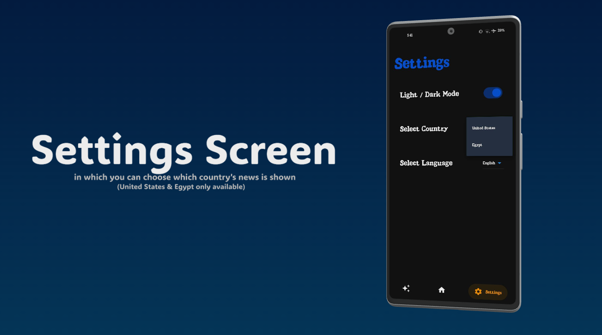
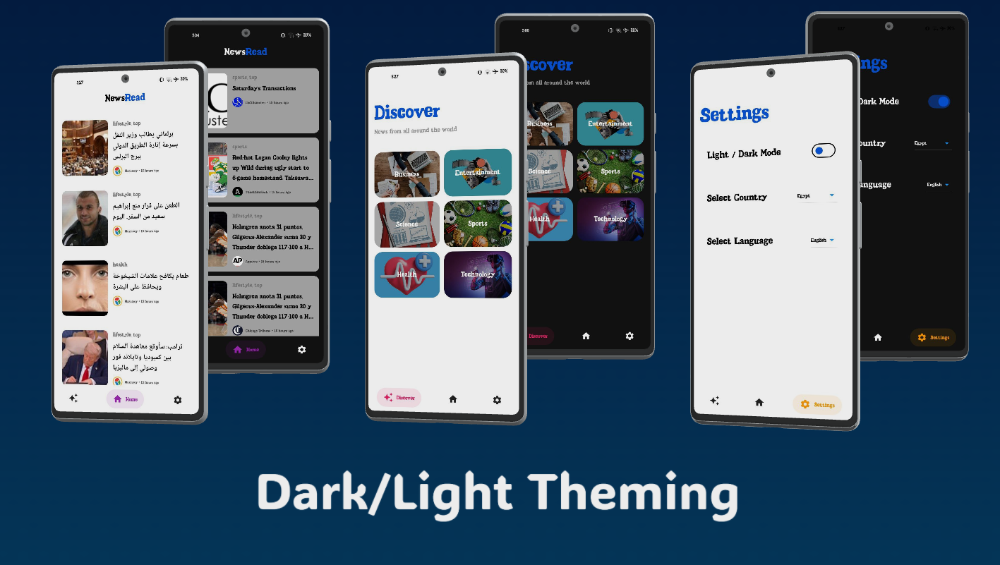
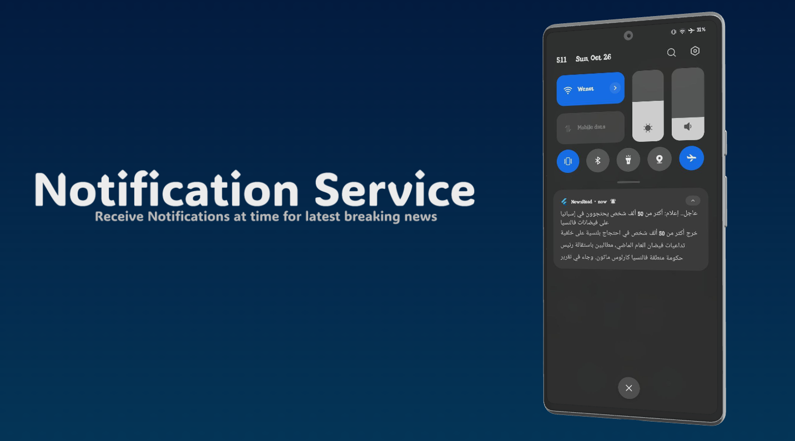

# NewsRead 📱

A modern news application for Android, fetching and displaying news articles from multiple sources with a dynamic and customizable user experience.

## About
**NewsRead** is an Android application that provides users with the latest news across various categories.  
It offers a seamless reading experience with customizable settings and real-time updates.

## Mockup Screens

<table> <tr> <td></td> <td></td> <td></td> </tr> <tr> <td></td> <td></td> </tr> </table>


## Features
- 📰 **Functionality**: Fetches and displays news from multiple sources.
- 🛠️ **Custom UI Components**:
  - Interactive bottom navigation bar.
  - News card widgets for attractive content display.
  - Dedicated categories view.
- 🔥 **State Management**:
  - Implemented using **Cubit** (BLoC pattern).
  - Manages news fetching services and handles app states (loading, success, error).
  - Internet connectivity monitoring.
- 🔄 **Real-time Updates**: Pull-to-refresh functionality for instant news refresh.
- 🎨 **Theming**:
  - Supports customizable UI themes (Dark Mode / Light Mode).
- 📲 **User Features**:
  - Detailed article viewing screen.
  - Discover page featuring categorized news.
  - Settings page for user preferences (choose news country and app language).
- 🚀 **Push Notifications Integration**:
  - Integrated **Firebase Cloud Messaging (FCM)** for sending breaking news notifications automatically.

## Technologies Used
- Flutter (Dart)
- Cubit (BLoC Pattern) for State Management
- Firebase Cloud Messaging (FCM)
- REST API for fetching news
- Internet Connectivity Package
- Custom Theming (Dark/Light Modes)

## Getting Started

### Prerequisites
- Flutter SDK installed
- Android Studio or VS Code with Flutter extension

### Installation Steps
1. Clone the repository:
   ```bash
   git clone https://github.com/yourusername/NewsRead.git
